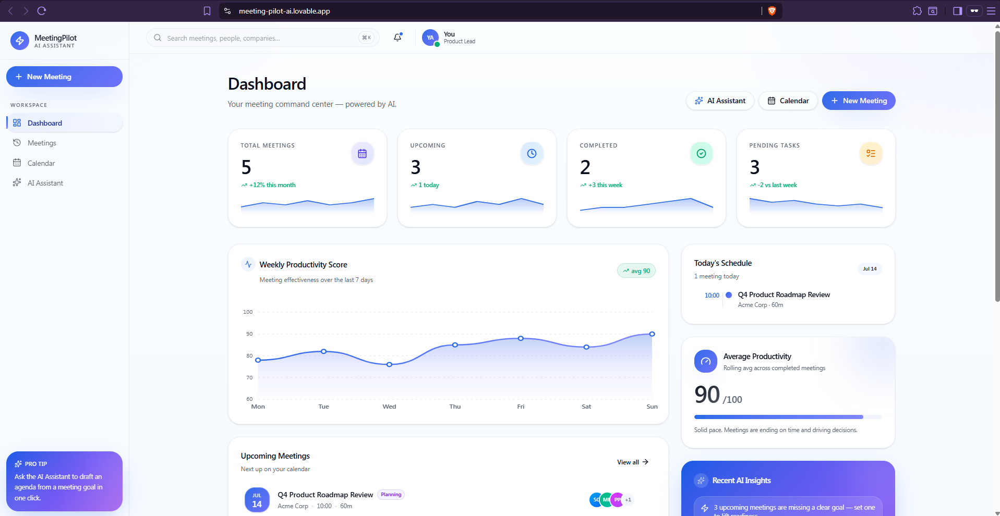
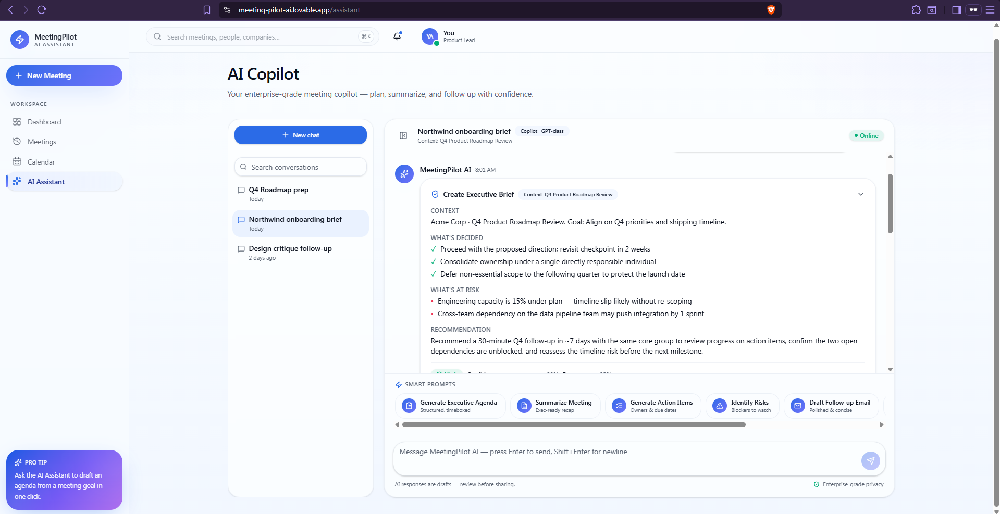
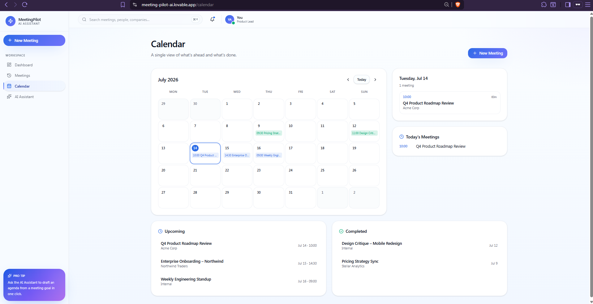
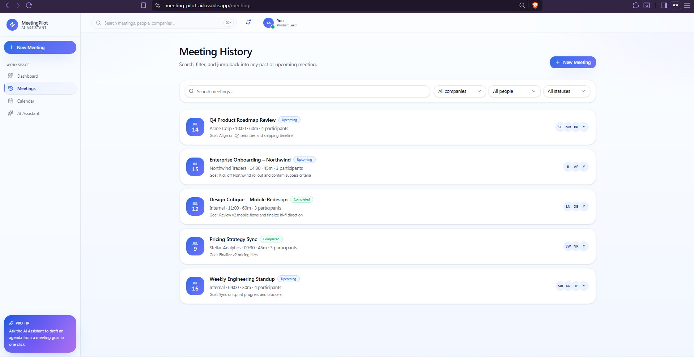
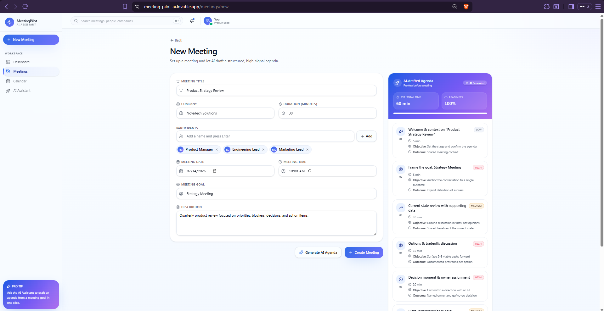

# MeetingPilot AI

An AI-powered meeting workspace designed to help teams prepare better meetings, generate structured agendas, organize meeting history, track action items, and work with an intelligent AI Copilot.

## Live Demo

[Open MeetingPilot AI](https://meeting-pilot-ai.lovable.app/)

## Overview

MeetingPilot AI brings meeting preparation, organization, scheduling, and AI-powered assistance into one modern workspace.

The application is designed to help teams reduce time spent preparing meetings, organize important information, and generate useful meeting outputs from one centralized platform.

## Key Features

### AI Copilot

A conversational AI workspace that helps users:

- Generate executive agendas
- Summarize meetings
- Create action items
- Identify risks
- Highlight important decisions
- Draft follow-up emails
- Generate executive briefs
- Suggest next steps

### Smart Prompts

The AI Copilot includes quick prompt suggestions for common meeting tasks:

- Generate Executive Agenda
- Summarize Meeting
- Generate Action Items
- Identify Risks
- Draft Follow-up Email
- Create Executive Brief
- Suggest Next Steps

### Smart Meeting Creation

Users can create and organize meetings by entering information such as:

- Meeting title
- Meeting objective
- Participants
- Date and time
- Meeting type
- Meeting description

The application can then generate a structured meeting agenda.

### Dashboard

The dashboard provides a clear overview of:

- Total meetings
- Upcoming meetings
- Completed meetings
- Meeting productivity
- Recent activity
- Meeting statistics
- Upcoming schedule

### Meeting History

Users can:

- Review previous meetings
- Search meeting records
- Filter meetings by status
- View meeting participants
- Review meeting dates and duration
- Access meeting details and summaries

### Calendar

The calendar provides a visual overview of scheduled meetings and helps users organize upcoming activities.

### AI-Generated Content

MeetingPilot AI can generate:

- Meeting agendas
- Executive summaries
- Action items
- Decisions
- Risk analysis
- Follow-up emails
- Recommended next steps

### AI Response Actions

Generated AI responses can include actions such as:

- Copy
- Regenerate
- Save to Meeting
- Export
- Share

### Conversation History

The AI Copilot includes a conversation sidebar where users can review and search previous AI conversations.

## Screenshots

### Dashboard

### AI Copilot

### Calendar

### Meeting History

### Create Meeting

## User Experience

The interface was designed to provide:

- A clean enterprise SaaS experience
- Simple and intuitive navigation
- Clear information hierarchy
- Responsive layouts
- Professional dashboards
- Smooth interactions
- Organized meeting workflows
- Modern AI chat experience

## Built With

- Lovable
- React
- TypeScript
- Tailwind CSS
- AI-assisted development
- Responsive web design

## Project Goal

The goal of MeetingPilot AI is to demonstrate how artificial intelligence can improve common business meeting workflows.

Instead of using separate tools for meeting preparation, scheduling, summaries, action items, and follow-up tasks, MeetingPilot AI combines these processes into one unified workspace.

## Example Use Cases

MeetingPilot AI can support:

- Project teams
- Product managers
- Team leaders
- Remote teams
- Consultants
- Sales teams
- Operations teams
- Executive meetings
- Client meetings
- Internal planning sessions

## Development Process

The project was developed through an AI-assisted product development process:

1. Identifying a real business workflow problem
2. Defining the product structure and user experience
3. Designing the meeting management workflow
4. Building the application interface with Lovable
5. Improving the dashboard and navigation
6. Creating the AI Copilot experience
7. Adding meeting history and calendar functionality
8. Testing and polishing the interface
9. Preparing the project for portfolio presentation

## Future Improvements

Potential future improvements include:

- Real AI model integration
- User authentication
- Cloud database storage
- Google Calendar integration
- Microsoft Outlook integration
- Real-time collaboration
- Meeting transcript uploads
- Voice transcription
- Automated email delivery
- Team workspaces
- Role-based access control
- PDF export
- Advanced meeting analytics
- Slack and Microsoft Teams integration
- Notifications and reminders

## Current Status

The current version is a functional portfolio prototype demonstrating the product experience, interface, meeting workflows, and AI-assisted features.

## Author

**Daniel Paunovski**

- [LinkedIn](https://www.linkedin.com/in/daniel-paunovski-7ab25a12/)
- [GitHub](https://github.com/PaunovskiD)

## Feedback     

Feedback, ideas, and suggestions are welcome.

If you find the project interesting, consider giving the repository a star.
